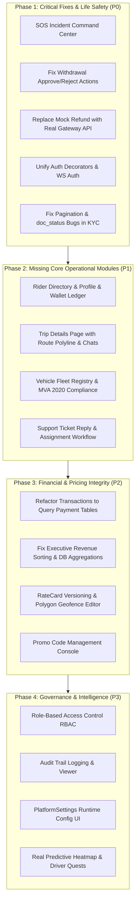

# SaaradhiGo Custom Admin Dashboard: Comprehensive Gap Analysis & Roadmap

**Document Version:** 1.0  
**Project:** SaaradhiGo / VahanGo Mobility Platform  
**Target Scope:** Custom Operational Admin Dashboard (`servers/admin_dashboard/` and `templates/admin_pages/`)  
**Context:** Excluding Django built-in `django.contrib.admin` (`/admin/`). This analysis evaluates the custom-built web operational dashboard against production ride-hailing standards (Uber, Ola, Rapido) and the existing backend data models and APIs.

---

## 1. Executive Summary & Architecture Overview

SaaradhiGo's backend features a robust domain architecture built on Django REST Framework, Django Channels (WebSockets), Redis, and PostgreSQL/PostGIS. It encompasses rich domain models for drivers, vehicles, riders, trips, payments, rate cards, surge pricing, SOS emergency events, and support tickets.

Alongside the Django built-in ORM admin (`/admin/`), the repository provides a **custom, server-rendered Admin Dashboard** mounted at the root (`/`) powered by `servers/admin_dashboard/` and Tailwind CSS templates in `templates/admin_pages/`.

### The Core Problem
While the custom admin dashboard features an elegant dark/gold aesthetic, **a substantial disconnect exists between the backend capabilities and what the admin dashboard exposes**. Critical ride-hailing operational modules are either completely missing, simulated with mock UI/JavaScript alerts, broken by pagination/sorting bugs, or crippled by severe memory bottlenecks. 

Operational dispatchers, KYC verification agents, support personnel, and finance managers cannot perform essential day-to-day operations without falling back to raw database queries or the generic Django built-in admin.

---

## 2. Feature Coverage & Severity Matrix

The table below summarizes the operational domains required by SaaradhiGo, comparing backend model/API availability against current custom dashboard implementation:

| Operational Domain | Backend Models & APIs | Custom Admin Dashboard Status | Severity |
| :--- | :--- | :--- | :--- |
| **Fleet Monitor / God View** | `Trip`, `Driver`, Redis Geo, `/ws/admin/dashboard/` | ✅ Implemented (Live Leaflet map, but has auth bug & no active trips/SOS) | **HIGH** |
| **Driver Onboarding & KYC** | `Driver`, `Vehicle`, documents, KYC APIs | ⚠️ Half-baked (Only checks license, pagination broken, no RC/vehicle check, no reject reason) | **CRITICAL** |
| **Driver Profile & Management** | `Driver`, `Vehicle`, `DriverSession`, `DriverCancellation` | ⚠️ Partial (Summary stats and block/unblock work; cannot edit vehicles, bank accounts, or fatigue lockout) | **MEDIUM** |
| **Rider / Customer Management** | `customUser`, `Rider`, `Wallet`, `FavoritePlace`, `Rating` | ❌ **COMPLETELY MISSING** (No list, no profile, no wallet audit, no block/unblock) | **CRITICAL** |
| **SOS & Emergency Incident Center** | `SOSEvent`, `SOSEventUpdate`, SOS Admin APIs | ❌ **COMPLETELY MISSING** (Zero dashboard views, zero sound alerts, zero dispatch integration) | **BLOCKER / P0** |
| **Rides & Trip Lifecycle** | `Trip`, `TripStatus`, `FarePricing`, `ChatMessage`, `Receipt` | ⚠️ Deficient (Read-only list, no pagination, client-side search only, **no Trip Details page**) | **HIGH** |
| **Support & Dispute Resolution** | `SupportTicket`, `SupportMessage`, Support Admin APIs | ⚠️ Broken/Mock (Refund button triggers `alert()`, cannot reply to tickets, cannot assign, driver fare bug) | **CRITICAL** |
| **Driver Withdrawals & Payouts** | `WithdrawalRequest`, `DriverBankAccount`, `DriverUPIContact` | ⚠️ Non-functional ("Approve" & "Reject" buttons have no forms/handlers, data sourced from estimates) | **CRITICAL** |
| **Financial Ledger & Transactions** | `Payment`, `TransactionHistory`, `WebhookEvent` | ⚠️ Severely flawed (Loads ALL trips into Python RAM, ignores actual `Payment` and `TransactionHistory` tables) | **HIGH** |
| **Revenue Analytics** | `Trip`, `RateCard`, `ServiceZone` | ⚠️ Flawed (Alphabetical month sort bug `Apr` before `Aug`, in-memory trip looping, no export) | **MEDIUM** |
| **Fare & Surge Management** | `RateCard`, `ServiceZone`, `PlatformSettings` | ⚠️ Flawed (`@staff_member_required` auth mismatch, mutates versioned cards in-place, no zone polygon editor) | **HIGH** |
| **Predictive Heatmaps** | Demand modeling / spatial density | ❌ **FAKE / MOCK** (2-line view returning empty context, hardcoded CSS blur circles, hardcoded "Bandra West") | **HIGH** |
| **Driver Loyalty & Quests** | `IncentiveQuest` model | ⚠️ Cosmetic / Hardcoded (Hardcoded 100k "miles" target, ignores `IncentiveQuest` model entirely) | **MEDIUM** |
| **Promo Codes & Marketing** | `PromoCode`, `PromoRedemption` | ❌ **COMPLETELY MISSING** (Zero UI to create, edit, or monitor promo codes/discounts) | **HIGH** |
| **Vehicle Fleet & MVA Compliance** | `Vehicle` model, MVA 2020 expiry fields | ❌ **COMPLETELY MISSING** (No vehicle inventory, no expiry tracker for insurance/permit/fitness/PUC) | **HIGH** |
| **Platform Runtime Configuration** | `PlatformSettings` (runtime DB config) | ❌ **COMPLETELY MISSING** (Cannot adjust commission, cancellation fees, dispatch radius via UI) | **HIGH** |
| **Role-Based Access Control (RBAC)** | `customUser.role` | ❌ **COMPLETELY MISSING** (Binary `admin` check; no roles for Support, KYC, Finance, Dispatch) | **HIGH** |
| **Audit Trail & Activity Log** | `AdminAuditLog` model & services | ❌ **COMPLETELY MISSING** (Dashboard writes zero audit logs; no audit log viewer) | **HIGH** |
| **Push Notifications / Broadcasts** | `Notification` model, FCM integration | ❌ **COMPLETELY MISSING** (No console to broadcast push announcements to drivers or riders) | **MEDIUM** |
| **System Health & Webhooks** | Celery tasks, Redis queue, Webhooks | ❌ **COMPLETELY MISSING** (No visibility into task queues, webhook idempotency, or gateway errors) | **MEDIUM** |

---

## 3. Deep Dive: Completely Missing Operational Domains (P0 / Critical Gaps)

### Gap 1: Rider / Customer Management Suite
* **Current State:** The dashboard has no rider navigation item, no views, and no templates. In `global_search.html`, search results show rider names, but they are plain text with no clickable links.
* **Missing Capabilities:**
  1. **Rider Directory:** Paginated list of registered riders with search by phone number, name, email, status (active, suspended, deleted), and registration date.
  2. **Rider Profile & 360° View:**
     - Personal details and emergency contacts.
     - Lifetime booking metrics: Total rides requested, completed, cancelled, total spend, average rating given and received.
     - Saved favorite places (Home, Work).
  3. **Rider Wallet Ledger:** Real-time visibility into the rider's `Wallet` balance, `WalletTransaction` history, and ability for authorized finance admins to issue manual credits/refunds with mandatory audit reasons.
  4. **Account Suspension & Fraud Controls:** Ability to block/suspend riders for policy violations (frequent cancellations, abusive behavior, payment fraud) and inspect rating feedback left by drivers.

### Gap 2: SOS & Emergency Incident Command Center
* **Current State:** `servers/sos/models.py` defines `SOSEvent` and `SOSEventUpdate` with rich fields (`trip_id`, `raised_by`, `current_lat`, `current_lng`, `status`: `TRIGGERED`, `ACKNOWLEDGED`, `RESOLVED`, `FALSE_ALARM`, `police_contacted`, `notes`). However, the custom admin dashboard has **zero screens or notifications for SOS events**.
* **Missing Capabilities:**
  1. **Life-Safety Alerting:** High-priority visual banner and audio chime that triggers instantly across all admin sessions when an SOS event is created.
  2. **Emergency Incident Dashboard:** Dedicated view showing active SOS incidents with live map tracking of the affected vehicle, rider details, driver details, and emergency contacts.
  3. **Action Workflows:** One-click buttons to mark incident acknowledged, log police contact/dispatch, add operator incident updates (`SOSEventUpdate`), and mark resolved or false alarm.

### Gap 3: Trip Details & Operational Dispatch Intervention
* **Current State:** `ride.html` provides a summary table of trips, but clicking on any trip does nothing. There is no Trip Detail view.
* **Missing Capabilities:**
  1. **Trip Detail Page (`/ride/<trip_id>/`):**
     - Interactive route map showing pickup pin, destination pin, intermediate stops, and actual GPS polyline traversed.
     - Full financial breakdown: Base fare, distance charge, time charge, surge multiplier, discount applied, GST/taxes, platform commission, net driver earnings.
     - Lifecycle timestamps: `requested_at`, `accepted_at`, `arrived_at`, `started_at`, `completed_at`, `cancelled_at`.
     - In-trip chat history (`ChatMessage` between rider and driver).
     - Rating and feedback scores from both parties (`Rating`).
     - Digital receipt preview (`Receipt`).
  2. **Dispatcher Controls:** Ability to cancel an unfulfilled/stalled ride with reason, trigger re-dispatch, or adjust fare in dispute cases.

### Gap 4: Promo Codes, Coupons & Campaign Management
* **Current State:** `PromoCode` and `PromoRedemption` models exist in `servers/ride/models.py`, but the admin dashboard has zero interface to manage them.
* **Missing Capabilities:**
  1. **Promo Code Console:** List, create, edit, activate, and expire promo codes.
  2. **Discount Rules:** Support percentage discounts with maximum caps (`max_discount_amount`), flat amount discounts, minimum fare thresholds (`min_fare`), and zone scoping (e.g. Hyderabad only).
  3. **Usage Controls & Burn Tracking:** Set `max_total_redemptions`, `max_per_user_redemptions`, and track real-time campaign redemption spend vs budget.

### Gap 5: Vehicle Fleet Registry & MVA 2020 Regulatory Compliance
* **Current State:** Vehicles are managed only as a secondary field under a driver. There is no vehicle inventory or fleet compliance view.
* **Missing Capabilities:**
  1. **Fleet Inventory:** Table of all registered vehicles with filters by vehicle type (Auto, Bike, Sedan, SUV), status (`active`, `inactive`, `under_maintenance`), and verification state.
  2. **MVA 2020 Compliance Expiry Tracker:** Motor Vehicle Aggregator Guidelines 2020 strictly mandate aggregator verification of insurance, permit, fitness, and PUC. The dashboard needs an expiry radar highlighting documents expiring in < 30 days and vehicles auto-blocked due to expired credentials.
  3. **Vehicle Document Review:** Verification workflow for `rc_doc`, `vehicle_pic`, and commercial registration numbers.

### Gap 6: Platform Runtime Configuration & Feature Flags
* **Current State:** `PlatformSettings` model (`servers/pricing/models.py`) allows storing runtime configuration in PostgreSQL to avoid server restarts. It is completely unexposed in the dashboard.
* **Missing Capabilities:**
  1. **Settings Editor:** Web UI to manage global key-value parameters:
     - Default platform commission rate (%).
     - Rider & driver cancellation fee amounts and grace periods.
     - Matchmaking search radius (km) and driver dispatch response timeout (seconds).
     - Global surge toggle (enable/disable automated surge platform-wide).
     - Emergency support hotline phone numbers.
     - App maintenance mode banner toggle.

### Gap 7: Granular Role-Based Access Control (RBAC) & Staff Administration
* **Current State:** The platform uses a single binary flag (`role == 'admin'` or `is_superuser`). Every admin has unrestricted access to everything.
* **Missing Capabilities:**
  1. **Role Segmentation:**
     - **Super Admin:** Full platform access, settings, rate cards, and staff management.
     - **Operations / Dispatcher:** God View, active rides, driver status toggles, SOS monitor.
     - **KYC Verification Agent:** Access restricted to `driver_onboarding` and vehicle approvals.
     - **Support Agent:** Access restricted to `dispute_support`, ticket replies, and rider inquiries.
     - **Finance Manager:** Access restricted to `payment_dashboard`, withdrawals, and revenue analytics.
  2. **Staff User Management:** Interface to invite, create, deactivate, and assign roles to administrative personnel.

### Gap 8: Immutable Audit Trail Viewer
* **Current State:** `AdminAuditLog` model in `servers/admin_audit/models.py` has fields for `actor`, `action`, `target_type`, `target_id`, `before`, `after`, `reason`, `ip_address`. However:
  - Custom admin dashboard views never write to `AdminAuditLog` on modifications.
  - There is no UI in the dashboard to review audit logs.
* **Missing Capabilities:**
  - Automated logging of every administrative write (KYC approval/rejection, driver block/unblock, rate card update, withdrawal approval/rejection, refund issuance).
  - Searchable audit log viewer with actor, date range, action type, and diff comparison view.

---

## 4. Deep Dive: Bugs, Mock Features & Half-Baked Implementations in Existing Modules

### 4.1 Support Center & Dispute Resolution (`dispute_support`)
1. **Mock Refund Alert:** In `templates/admin_pages/dispute_support.html` (line 179), clicking "Issue Full Refund" executes:
   ```javascript
   onclick="alert('Refund initiated for ₹' + '...')"
   ```
   This is purely decorative. No backend endpoint is called, no refund transaction is initiated, and no ticket state changes.
2. **Missing Reply & Ticket Workflow:** There is no form or textarea to write a reply to the customer (even though `SupportMessage` model and `/api/v1/support/admin/tickets/<id>/reply/` exist). Admins cannot assign tickets to staff members or change status from `OPEN` to `RESOLVED` or `CLOSED`.
3. **Driver Context Bug:** Line 139 of `views.py` explicitly executes:
   ```python
   ticket.driver = None
   ```
   Consequently, `selected_ticket.driver` is always `None` in the template, rendering "None" for the driver and `₹0.00` for the fare calculation.
4. **Dead Floating Action Button:** A floating `+` button exists at line 200 of `dispute_support.html` with no click handler or modal.

### 4.2 Payment Dashboard & Withdrawal Approvals (`payment_dashboard`)
1. **Dead Action Buttons:** In `templates/admin_pages/payment_dashboard.html` (lines 138-147), the "Approve" and "Reject" buttons for driver withdrawals are static HTML buttons with **no form wrapper, no onclick handler, and no JavaScript**:
   ```html
   <button type="button" class="... text-emerald-600 ...">Approve</button>
   <button type="button" class="... text-rose-600 ...">Reject</button>
   ```
   Admins cannot approve or reject driver payouts from this screen.
2. **Dead Header Buttons:** "Export Statement" and "Initiate Bulk Payouts" buttons (lines 21-29) have no attached logic.
3. **Flawed Revenue Source:** Line 175 of `views.py` calculates `total_payments` using:
   ```python
   FarePricing.objects.aggregate(total_revenue=models.Sum('total_fare'))['total_revenue']
   ```
   `FarePricing` stores pre-ride price quotes, not actual payments collected! Actual collections must be aggregated from `Payment.objects.filter(status='completed')`.
4. **Single-Sided Data:** The table only displays `WithdrawalRequest` rows, completely ignoring rider customer payments, payment gateway transactions, wallet top-ups, and chargebacks.
5. **Debug Statement Left in Production:** Line 182 contains `print(page_obj)`.

### 4.3 Transaction Dashboard (`transaction_dashboard`)
1. **Severe Memory & Performance Risk:** Lines 1363-1372 of `views.py` execute:
   ```python
   trips = list(Trip.objects.select_related(...).order_by("-requested_at"))
   ```
   This loads **every single trip in the database** into Python memory, iterates through them in a Python loop to synthesize imaginary transaction rows, and then slices them with Paginator. Under production scale (e.g. 50,000+ trips), this view will exhaust worker RAM and cause HTTP 504 gateway timeouts.
2. **Bypasses Real Payment Tables:** The backend has actual models: `TransactionHistory`, `Payment`, and `WalletTransaction`. The dashboard bypasses these dedicated tables entirely.
3. **No Financial Reconciliation or Export:** No ability to filter by gateway (`razorpay` vs `cashfree` vs `cash` vs `wallet`), no transaction reconciliation status, and no CSV/Excel export for financial reporting.

### 4.4 Driver Onboarding & KYC (`driver_onboarding`)
1. **Broken Pagination:** The view accepts `page_number = request.GET.get("page", 1)`, but **never creates a `Paginator` or `page_obj`**. The template tests ``, which always fails silently. All drivers are queried without pagination.
2. **Unsaved Timestamp Bug:** Line 122 of `views.py`:
   ```python
   selected_driver.doc_status_updated_at = timezone.now()
   ```
   This assignment occurs **after** `selected_driver.save()` was called in lines 118 and 121. The update timestamp is never saved to the database.
3. **Crash on Unselected/Invalid Driver:** `Driver.objects.get(id=selected_driver_id)` lacks exception handling (`DoesNotExist` causes 500 error). If a POST request is submitted without `selected_driver_id`, `selected_driver` is `None`, causing `AttributeError` on line 116.
4. **Single-Document Verification:** Only displays `license_doc`. Ignores `license_doc_back`, `license_expiry`, and all vehicle compliance documents (`rc_doc`, insurance, permit, fitness, PUC).
5. **No Rejection Notes:** Rejection is binary without allowing the admin to supply rejection notes or missing document requests to the driver.

### 4.5 Driver Profile (`driver_profile`)
1. **Incomplete Management:** While stats and block/unblock work, admins cannot:
   - View or edit driver bank accounts (`DriverBankAccount`) or UPI IDs (`DriverUPIContact`).
   - View or manage driver shifts / sessions (`DriverSession`).
   - Inspect driver cancellation history and penalties (`DriverCancellation`).
   - Inspect or manually reset `fatigue_lockout_until` (MVA 2020 fatigue rule).
   - View or download the vehicle RC document (`rc_available` is passed only as a boolean flag).

### 4.6 Ride Management (`ride`)
1. **No Database Pagination:** Line 1317 passes `'trips': trips` directly. Slicing and pagination are absent, risking memory exhaustion.
2. **Client-Side Search Limitation:** Search operates exclusively on the table rows currently rendered in the DOM via JavaScript. Trips not on the screen cannot be searched.
3. **Status Filter Bug:** Line 1288 computes `reached_count`, but `'reached'` is omitted from `valid_statuses` (line 1246), preventing filtering by reached status.
4. **No Route or Incident Visibility:** No way to view route polylines, GPS pings, or rider-driver chat logs.

### 4.7 God View / Fleet Monitor (`fleet_monitor`)
1. **Authentication Inconsistency Bug:**
   - The web view uses `@admin_required`, which accepts `user.role == 'admin' or user.is_superuser`.
   - The WebSocket endpoint (`AdminDashboardConsumer` in `servers/consumers.py`, line 1712) strictly checks:
     ```python
     if not (self.user.is_staff or self.user.is_superuser):
         await self.close(code=4003)
     ```
   - An admin created with `role='admin'` but `is_staff=False` can log into the dashboard, but the live map WebSocket immediately disconnects with code 4003 ("user is not an admin").
2. **Driver Telemetry Only:** Shows online driver markers, but does not display active ongoing rides, pickup/drop pins, active customer requests, or SOS distress indicators.
3. **Dead Action Button:** "Dispatch Dashboard" button in the sidebar has no destination.

### 4.8 Executive Revenue Analytics (`executive_revenue`)
1. **Chronological Sorting Bug:** Lines 388-391 sort monthly revenue using:
   ```python
   monthly_revenue = sorted(monthly_data.values(), key=lambda x: x["month"])
   ```
   `x["month"]` is formatted as `"%b %Y"` (e.g. "Apr 2026", "Aug 2026", "Dec 2025"). Sorting alphabetically orders `Apr` before `Aug`, and `Dec` before `Jan`, completely corrupting the monthly growth trajectory chart.
2. **In-Memory Trip Processing:** Iterates through all completed trips in Python memory instead of utilizing database-level `TruncMonth` and `Sum` aggregations.
3. **No Export Function:** No capability to export revenue statements or tax breakdowns to CSV or PDF.

### 4.9 Fare & Surge Management (`fare_surge`)
1. **Auth Decorator Mismatch:** The view `update_global_config` is decorated with `@staff_member_required` (line 957) instead of `@admin_required`, redirecting non-staff admins to the Django standard login screen.
2. **Breaks RateCard Immutability:** `RateCard` is architected as an immutable, versioned model (`version`, `effective_from`, `effective_to`). Instead of creating a new versioned card, `update_global_config` mutates existing rate cards in-place.
3. **Missing Zone Geofencing:** No map interface to view service zone boundaries or draw polygon geofences.
4. **Omitted Commercial Fields:** Form only captures base fare, per km, per min, surge cap, and night surge. It omits `commission_percent` and `gst_percent`, leaving platform commissions and taxes uneditable from the UI.

### 4.10 Predictive Heatmaps (`predictive_heatmaps`)
1. **Empty Shell View:** `views.py` (lines 1673-1674):
   ```python
   @admin_required
   def predictive_heatmaps(request: HttpRequest) -> HttpResponse:
       return render(request, "admin_pages/predictive_heatmaps.html")
   ```
   No data is queried, no demand calculations are performed, and no context variables are passed.
2. **Hardcoded Mock UI:** Template contains hardcoded CSS blur overlays, hardcoded location text ("Bandra West: 2.4x Surge" — a Mumbai suburb, despite SaaradhiGo targeting Hyderabad), and a loop over empty `demand_zones`. The map itself is an empty div with the comment `<!-- Simulated Map -->`.

### 4.11 Driver Loyalty (`driver_loyalty`)
1. **Metric Unit Mismatch:** All copy and calculations display "miles" / "mi" (e.g., "Target: 100000 mi"), whereas the Indian market and the underlying database field (`actual_distance_km`) operate in kilometers.
2. **Disconnected from Database Quests:** Ignores the actual `IncentiveQuest` model (`target_trips`, `reward_amount`, `start_date`, `end_date`, `is_active`). Admins cannot create, review, or distribute quest bonuses.

---

## 5. Technical Debt & Security Considerations

1. **Scalability / O(N) Memory Bloat:**
   - Multiple views (`transaction_dashboard`, `executive_revenue`, `ride`) load entire querysets into Python lists instead of delegating pagination and aggregation to PostgreSQL. This will cause Out-Of-Memory (OOM) crashes under production volume.
2. **Authorization Inconsistencies:**
   - Web views use `@admin_required` (`user.role == 'admin'`).
   - Fare API uses `@staff_member_required` (`user.is_staff`).
   - WebSocket uses `user.is_staff or user.is_superuser`.
   - All three auth mechanisms must be unified to check `user.role == 'admin' or user.is_staff or user.is_superuser`.
3. **Absence of Audit Logging:**
   - High-impact decisions (blocking drivers, modifying rate cards, reviewing KYC) leave zero trail in `AdminAuditLog`, violating regulatory compliance and fraud auditability.
4. **Mock Actions & Dead Elements:**
   - Fake refund `alert()`, dead withdrawal approve/reject buttons, and unlinked search results degrade operator trust and functionality.

---

## 6. Prioritized Remediation Roadmap



### Phase 1: Critical Fixes & Life-Safety (Immediate)
1. **SOS Emergency Command Center:**
   - Create `/sos/` view in admin dashboard.
   - Add real-time audio/visual alert trigger in `base.html` listening to WebSocket or polling SOS status.
   - Implement action endpoints to acknowledge, dispatch police, and resolve incidents.
2. **Wire Real Payout & Refund Actions:**
   - Connect withdrawal table buttons in `payment_dashboard.html` to POST endpoints calling `approve_withdrawal_admin` and `reject_withdrawal_admin`.
   - Replace `alert()` in `dispute_support.html` with a modal that submits to the payment gateway refund API.
3. **Unify Authentication & Fix WS 4003 Rejection:**
   - Update `AdminDashboardConsumer` to allow users where `user.role == 'admin'`.
   - Change `@staff_member_required` on `update_global_config` to `@admin_required`.
4. **Repair KYC Onboarding View:**
   - Implement standard Django `Paginator` in `driver_onboarding` view.
   - Fix line 122 so `doc_status_updated_at` is saved before database commit.
   - Add rejection notes form field.

### Phase 2: Missing Operational Modules (Sprint 1)
1. **Rider Management Suite:**
   - Add `/riders/` list view with search and pagination.
   - Build `/riders/<rider_id>/` profile view displaying contact info, ride history, wallet balance, and block/unblock toggle.
2. **Trip Details Page:**
   - Create `/ride/<trip_id>/` view and template.
   - Embed Leaflet map with pickup/drop pins and route polyline.
   - Display fare breakdown, chat transcript, ratings, and cancellation reason.
3. **Vehicle & MVA 2020 Compliance:**
   - Add `/vehicles/` fleet registry.
   - Implement document expiry alerts (insurance, fitness, permit, PUC) with filters for expired credentials.
4. **Complete Support Ticket Resolution:**
   - Add reply input box to `dispute_support.html` backed by `SupportMessage`.
   - Add status dropdown (Open, Pending, Resolved, Closed) and agent assignment.

### Phase 3: Financial & Commercial Enhancements (Sprint 2)
1. **Transaction Dashboard Overhaul:**
   - Refactor `transaction_dashboard` to query `TransactionHistory` and `Payment` directly.
   - Add CSV export for accounting reconciliation.
2. **Executive Revenue Fixes:**
   - Replace Python in-memory iterations with database `TruncMonth` aggregations.
   - Fix month key sorting from alphabetical `"%b %Y"` to chronological `"%Y-%m"`.
3. **Promo Code Console:**
   - Create `/promos/` view for full CRUD on `PromoCode` and redemption tracking.
4. **Fare & Surge Upgrade:**
   - Respect `RateCard` versioning and immutability on edits.
   - Expose platform commission % and GST % fields in fare forms.

### Phase 4: Enterprise Governance & Advanced Intelligence (Sprint 3)
1. **Role-Based Access Control (RBAC):**
   - Create role permissions for Dispatcher, Support, KYC, Finance, and Super Admin.
   - Enforce view-level permission decorators and conditional sidebar navigation.
2. **Automated Audit Logging:**
   - Hook all admin dashboard mutating actions into `AdminAuditLog`.
   - Add an Audit Log viewer screen at `/audit/`.
3. **Platform Runtime Configuration:**
   - Build `/settings/` UI to edit `PlatformSettings` dynamically without restarts.
4. **Real Spatial Heatmaps & Quests:**
   - Replace mock heatmap with Leaflet heat layer using spatial ride request density from PostGIS/Redis.
   - Integrate `IncentiveQuest` model into `driver_loyalty` with quest creation forms and tracking.

---

## 7. Conclusion

The SaaradhiGo backend infrastructure is rich in features and domain modeling, but the custom Admin Dashboard currently serves as an incomplete presentation layer with critical functional gaps. 

Addressing the **P0 life-safety gaps (SOS command center)**, **fixing non-functional action buttons (payouts and refunds)**, **unifying authentication**, and **introducing the missing Rider and Trip Detail modules** will elevate the custom admin dashboard into an enterprise-grade operational center capable of supporting SaaradhiGo's commercial launch and growth targets.
